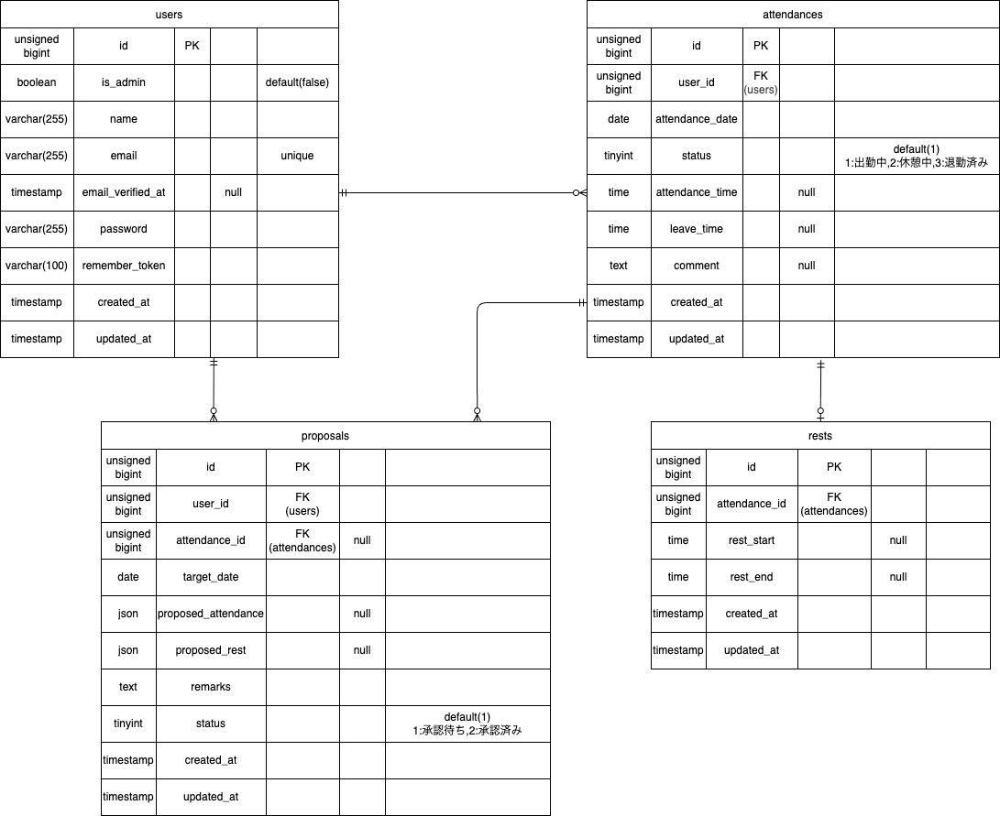

#  🕰️  time-tracker__test
coachtech模擬案件　勤怠管理アプリ
## 📃laravel環境構築
**🐳Dockerビルド**
1. gitのクローン
```bash
git clone git@github.com:RINGO-days/time-tracker__test.git
```
2. Dockerデスクトップアプリを立ち上げる
3. ワーキングディレクトリに移動
```bash
cd free-market-test
```

4. Dockerの立ち上げ
```bash
docker-compose up -d --build
```
<details>
<summary style="cursor: pointer;">⚠️ Mac(Apple Silicon)をお使いの方</summary>

>Apple Silicon搭載のMacでは、docker-conpose up -d実行時に以下のエラーが発生することがあります
>### 🚫症状
>`The requested image's platform (linux/amd64) does not match the detected host platform`
>などの警告が出て、作業が終了する場合がある。
>### 💡対策
>docker-compose.ymlを開き、プラットフォームを明示する。
>```text
>mysql:
>        image: mysql:8.0.26
>        platform: linux/amd64　←この行を追加
>        environment:
>        〜
>```

</details>

## 🌲環境構築
**Dockerを立ち上げた後は、以下の手順を順番に実行してください**
### 1. phpコンテナへログイン
```bash
docker-compose exec php bash
```
### 2. ライブラリのインストール
```bash
composer install
```
### 3. 環境設定ファイルの作成
```bash
cp .env.example .env
```
### 4. アプリケーションキーの作成
```bash
php artisan key:generate
```
### 5. データベースおよび初期データの投入
```bash
php artisan migrate:fresh --seed
```
## 🛠使用技術
- Laravel 8.83.29
- PHP 8.1.34
- mysql 8.0.26
- nginx 1.21.1
- phpMyAdmin
- MailHog
- Fortify
- Sanctum

## 📍開発環境
- http://localhost ホーム画面
- http://localhost/register 新規会員登録画面
- http://localhost/login スタッフログイン画面
- http://localhost/admin/login 管理者ログイン画面
- http://localhost:8080 phpMyAdmin
- http://localhost:8025 MailHog

## 🔑実装内容
要件シートに則った基本要件の実装
### メール認証
mailhogを使用(メール認証画面：<a>http://localhost:8025</a>)<br>
メース認証画面への遷移画面にて、メール再送信機能、および再送信時にメッセージを表示
### ダミーデータ
| 名前 | メールアドレス | パスワード | 役割 |
| :-- | :-- | :-- | :-- |
| ユーザー1（一般） | `user1@example.com` | `password` | 過去５ヶ月の15日分の通常勤怠データ(09:00 ~ 18:00 休憩 12:00~13:00)、及び当月のみ通常勤怠が10日、残業(09:00~20:00)3日、遅刻(09:30~18:00)2日、早退(09:00~17:00)1日、長時間労働(09:00~21:00)1日 の17日分のデータがあるユーザー |
| ユーザー2（一般） | `user2@example.com` | `password` | 勤怠が存在しないユーザー |
| ユーザー3（管理者） | `user3@example.com` | `password` | 管理者ユーザー |
### テーブル仕様
#### **usersテーブル**
| カラム名 | 型 | primary key | unique key | not null | foreign key |
| --- | --- | --- | --- | --- | --- |
| id | unsigned bigint | ○ | | ○ | |
| is_admin | boolean |  |  | ○ |  |
| name | varchar(255) |  |  | ○ |  |
| email | varchar(255) |  | ○ | ○ |  |
| email_verified_at | timestamp |  |  |  |  |
| password | varchar(255) |  |  | ○ |  |
| remenber_token | varchar(100) |  |  | ○ |  |
| created_at | timestamp |  |  | ○ |  |
| updated_at | timestamp |  |  | ○ |  |

#### **attendancesテーブル**
| カラム名 | 型 | primary key | unique key | not null | foreign key |
| --- | --- | --- | --- | --- | --- |
| id | unsigned bigint | ○ | | ○ | |
| user_id | unsigned bigint |  |  | ○ | users(id) |
| attendance_date | date |  |  | ○ |  |
| status | tinyint |  |  | ○ |  |
| attendance_time | time |  |  |  |  |
| leave_time | time |  |  |  |  |
| comment | text |  |  |  |  |
| created_at | timestamp |  |  | ○ |  |
| updated_at | timestamp |  |  | ○ |  |
#### **restsテーブル**
| カラム名 | 型 | primary key | unique key | not null | foreign key |
| --- | --- | --- | --- | --- | --- |
| id | unsigned bigint | ○ | | ○ | |
| attendance_id | unsigned bigint |  |  | ○ | attendances(id) |
| rest_start | time |  |  |  |  |
| rest_end | time |  |  |  |  |
| created_at | timestamp |  |  | ○ |  |
| updated_at | timestamp |  |  | ○ |  |
#### **proposalsテーブル**
| カラム名 | 型 | primary key | unique key | not null | foreign key |
| --- | --- | --- | --- | --- | --- |
| id | unsigned bigint | ○ | | ○ | |
| user_id | unsigned bigint |  |  | ○ | users(id) |
| attendance_id | unsigned bigint |  |  |  | attendances(id) |
| target_date | date |  |  | ○ |  |
| proposed_attendance | json |  |  |  |  |
| proposed_rest | json |  |  |  |  |
| remarks | text |  |  | ○ |  |
| status | tinyint |  |  | ○ |  |
| created_at | timestamp |  |  | ○ |  |
| updated_at | timestamp |  |  | ○ |  |
### 📃ER図

### 月次勤怠のCSVファイル出力
管理者画面の指定のスタッフの月次勤怠リストから開いているページの月の勤怠をCSVファイルにて出力
### API
- ルート設定はapiResourceを用いて、5エンドポイントを一括定義(index,store,show,update,desroy)<br>
- app/Http/Controllers/Api/V1/AttendanceApiController.phpを作成し、各アクションの定義<br>
- app/Http/Resources/AttendanceRecordResource.phpを作成し、各アクションのレスポンスのデータを整形する<br>
- app/Http/Requests/Api/V1/〜にIndexAttendanceRecordRequest.php,StoreAttendanceRecordRequest.php,UpdateAttendanceRecordRequest.phpを作成し、該当のアクションのリクエストデータのバリデーションを実装<br>
- app/Policies/AttendanceRecordPolicy.phpを作成し、update,destroyのアクション時に本人または管理者の権限の確認を行う<br>
- Laravel Sanctumを導入しstore,update,destroyのルートにミドルウェアauth:sanctumを適用
### マイ勤怠レポート画面表示機能
当月を基準に半年間の勤怠情報の集計画面の表示<br>
労働時間•残業時間の各合計時間、1日の平均労働時間の表示<br>
半年の期間の各月の勤怠情報<br>
遅刻回数、早退回数、長時間労働回数のカウント
## その他の機能要件以外の機能
- ### 勤怠リストのカレンダーアイコン、並びにその隣の現在表示中の日時の文字をクリックするとデータ表示したい月、または日を選ぶことができる
> スタッフページの月次勤怠リストや管理者ページの選択したスタッフの月次勤怠リスト、管理者ページの日時勤怠リストにinputタグのonchangeを使用し、表示したい日時を選択するとその日時のデータを表示する
---
- ### 勤怠修正の承認ステータスが２（了承済み）の場合、コメントが「了承済みです」に変更される
> 修正一覧からタブ切り替えで了承済みのデータの詳細ボタンを押した時、勤怠詳細画面にて「了承済みです」のコメントが表示される
---
- ### サービスクラスの作成
> App/Services/~にAttendanceServiceを作成。労働時間や休憩時間の計算、月次勤怠情報の取得など共通できるロジックをサービスクラスに入れ、コードの保守性を向上
> #### 作成したアクション
> - getMonthPeriod : array<br>
> 月次勤怠リストなどでクエリパラメータなどで対象の月を指定する時に使用する変数の定義
> - calculateRestTime : string<br>
> 指定した1日の勤怠のデータを渡し、その日の休憩時間を計算し文字列（HH:MM）で算出する
> - calculateRestTime : string<br>
> 出勤から退勤までの純労働時間から休憩時間を引いた、実労働時間を文字列（HH:MM）で算出する
> - getMonthlyRecords : array<br>
> １ヶ月間の期間の中の1日の勤怠情報（日時（曜日）、出勤、退勤、休憩、労働時間）を算出する
> - createAttendanceDetailProposal : Proposal(モデル)<br>
> 勤怠情報を修正申請しテーブルに保存、それと同時に管理者の場合、直接勤怠情報を修正するアクション<br>
> 後述する、新規で勤怠登録を行うアクションと同じ処理のため、サービスクラスにて共通化
---
- ### スタッフ用のミドルウェアと管理者用のミドルウェアの作成
> #### 意図
> スタッフと管理者の役割を棲み分けし、互いのページにアクセスできないよう設計。<br>
> よって管理者は打刻機能を使うことができない。また管理者画面のスタッフ一覧で管理者は表示されない。
> #### 機能
> スタッフは管理者用のページにアクセスしようとすると、アクセスできませんの旨のメッセージとともに<a>http://localhost/attendance</a>にリダイレクトされる。<br>
> 管理者も同じように一般スタッフ用ページにアクセスしようとすると<a>http://localhost/admin/attendance/list</a>にリダイレクトされる
> #### 作成したミドルウェア　（src/app/Http/Middleware/〜）
> - AdminMiddleware
> - StaffMiddleware
---
- ### 既存の勤怠データではなく、新規で勤怠データを作成するメソッドの作成
> 月次勤怠リストに出勤日の時間の記載がない欄の詳細ボタンから、新規で勤怠を作成するできるようにロジックを追加。
> #### 作成したルート
> - (スタッフ用)Route::get('/attendance/newDetail', [AttendanceDetailController::class, 'newDetail']); //新規勤怠登録画面の表示
> - (管理者用)Route::get('/admin/attendance/newDetail', [AdminController::class, 'newDetailByAdmin']); //新規勤怠登録画面の表示
> - Route::post('/newDetail/propose/staff/{id}', [AttendanceDetailController::class, 'newDetailPropose']); //登録画面から登録するアクション
---
- ### 修正申請する際に、既存の休憩データの値を消して送信した場合、restsテーブルのレコードを削除する
> 修正申請を行う勤怠詳細画面で、既存の休憩データの入力フィールドの値を休憩開始時間と休憩終了時間を消して送信し、管理者が承認、もしくは直接修正した場合に休憩テーブルの該当のレコードを削除するロジック
> #### 機能を追加したアクション
> - サービスクラス App/Services/AttendanceService **createAttendanceDetailProposal**
> - コントローラー AdminController **approve**